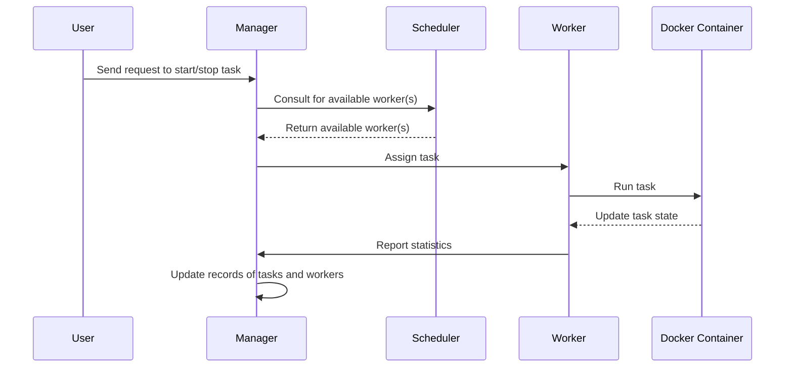

#### Trying to understand the orchestration nuts & bolts

#### Docker commands

- Start a container: `docker run -d -p 80:80 --name webserver nginx`
- Stop a container: `docker stop webserver`
- Inspect a container: `docker inspect webserver`
- Remove a container: `docker rm webserver`
- Remove an image: `docker rmi nginx`
- List containers: `docker ps -a`
- List images: `docker images`
- List networks: `docker network ls`
- List volumes: `docker volume ls`
- List all containers: `docker ps -a`
- List all containers with their IDs: `docker ps -aq`
- Remove specific containers: `docker rm container_id`

