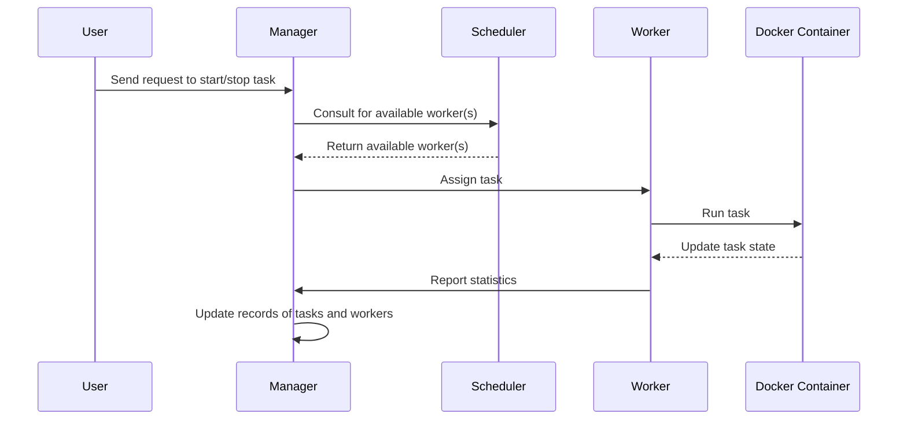

# Container Orchestration from Scratch

A lightweight container orchestration system built in Go, inspired by the book "Build Your Own Kubernetes".

## Overview

This project implements a simple container orchestration system that demonstrates the core concepts behind container orchestration platforms like Kubernetes. It provides a hands-on way to understand how container orchestration works under the hood.

Key features:
- Task scheduling and distribution
- Worker node management
- Container lifecycle management
- Simple HTTP API for interaction
- Resource monitoring

## Architecture

The system consists of three main components:

1. **Manager**: Distributes tasks to workers and maintains the system state
2. **Scheduler**: Determines which worker should handle each task
3. **Worker**: Executes tasks by running Docker containers

### Component Interaction



### Task Lifecycle

Tasks in the system go through the following states:
1. **Pending**: Initial state when a task is created
2. **Scheduled**: Task has been assigned to a worker
3. **Running**: Task is currently running as a Docker container
4. **Completed**: Task has finished successfully
5. **Failed**: Task has encountered an error

## Installation

### Prerequisites

- Go 1.16 or higher
- Docker

### Setup

1. Clone the repository:
   ```bash
   git clone https://github.com/yourusername/orchestration-go-scratch.git
   cd orchestration-go-scratch
   ```

2. Install dependencies:
   ```bash
   go mod download
   ```

3. Build the project:
   ```bash
   go build -o orchestration ./main
   ```

## Usage

### Starting the System

```bash
./orchestration
```

By default, the system will start with one worker on localhost:8080. You can configure the host and port using environment variables:

```bash
ORCHESTRATION_HOST=192.168.1.100 ORCHESTRATION_PORT=9000 ./orchestration
```

### API Endpoints

- `POST /tasks`: Submit a new task
- `GET /tasks`: List all tasks
- `GET /tasks/{id}`: Get details of a specific task
- `DELETE /tasks/{id}`: Stop and remove a task

### Example: Submitting a Task

```bash
curl -X POST http://localhost:8080/tasks -d '{
  "name": "web-server",
  "image": "nginx:latest",
  "memory": 512,
  "cpu": 1.0,
  "disk": 1,
  "exposedPorts": {"80/tcp": {}}
}'
```

## Development

### Project Structure

- `main/`: Contains the entry point of the application
- `manager/`: Implements the task distribution logic
- `scheduler/`: Implements the worker selection algorithm
- `worker/`: Implements the task execution logic
- `task/`: Defines the task model and Docker integration

### Docker Commands Reference

- Start a container: `docker run -d -p 80:80 --name webserver nginx`
- Stop a container: `docker stop webserver`
- Inspect a container: `docker inspect webserver`
- Remove a container: `docker rm webserver`
- Remove an image: `docker rmi nginx`
- List containers: `docker ps -a`
- List images: `docker images`
- List networks: `docker network ls`
- List volumes: `docker volume ls`
- List all containers with their IDs: `docker ps -aq`
- Remove specific containers: `docker rm container_id`

## References

This project was created while following the book "Build Your Own Kubernetes" to understand container orchestration concepts from first principles.

## License

MIT